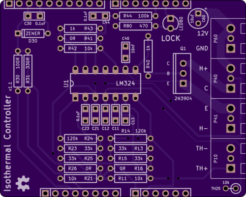
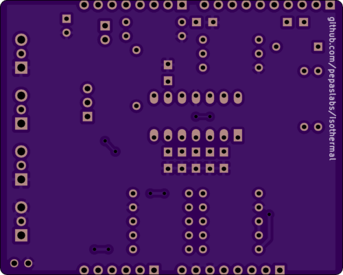
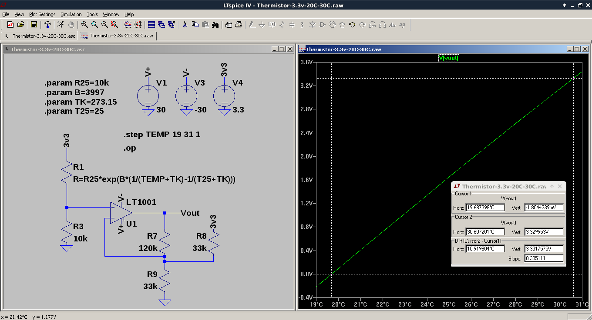

# isothermal

An Arduino shield which regulates temperature.  Originally, this was used to regulate the temperature of a Hammond 1590BB.

- [schematic](kicad/releases/v1.1/isothermal.pdf)
- [gerber files](kicad/releases/v1.1)
- [OSHPark link](https://oshpark.com/shared_projects/9wWvXwMw)
- [EEVBlog discussion](http://www.eevblog.com/forum/metrology/temperature-stabilised-enclosures-heating-and-or-cooling/msg1407134/#msg1407134)

The resistor values were chosen to map a 20C to 30C window onto (roughly) 0V to 3.3V.

See also  for PID tuning and measurements of a similar design (based on MCP9701 rather than thermistors).

## Bill of Materials (BOM)

- (1) LM324 op amp, DIP14.
  - [Tayda](https://www.taydaelectronics.com/lm324n-lm324-324-low-power-quad-op-amp-ic.html).
- (1) 2N3904 TO-92 NPN transistor.
  - Almost any TO-92 transistor should work here.
  - [Tayda](https://www.taydaelectronics.com/t-transistors/2n-series/2n3904-npn-general-propose-transistor.html).
  - The footprint is for a TO-220, in case you need to use a bigger transistor.
- (2) 10k thermistors.
  - I use Vishay [NTCLG100E2103JB](http://www.vishay.com/docs/29050/ntclg100.pdf) which are about $1 each from [Digi-key](https://www.digikey.com/product-detail/en/vishay-bc-components/NTCLG100E2103JB/BC2531-ND/773999).
  - You could also get away with [cheap epoxy bead thermistors](https://www.taydaelectronics.com/thermistors/10k-ohm-ntc-thermistor-5mm.html), though if the Beta is different you'll need to calibrate the gain of your controller.
- 1/2W or 1W (heater) resistors.
  - (10) 10R
    - [Tayda](https://www.taydaelectronics.com/resistors/1w-metal-film-resistors/resistor-10-ohm-1w-1-metal-film-pkg-of-10.html).
- 1/4W resistors, 1% metal film (precision-ish):
  - (2) 10k.
  - (4) 33k.
  - (2) 120k.
  - [Tayda](https://www.taydaelectronics.com/resistors/1-4w-metal-film-resistors/test-group-2.html).
- 1/4W resistors (non-precision):
  - (1) 100R
  - (1) 470R
    - The LED resistor -- 330R or 220R will also work.
  - (1) 1k
  - (4) 100k
  - [Tayda](https://www.taydaelectronics.com/resistors/1-4w-metal-film-resistors/test-group-2.html).
- (9) 0.1uF ceramic capacitors, through-hole or 0805.
  - [Tayda](https://www.taydaelectronics.com/capacitors/ceramic-disc-capacitors/10-x-0-01uf-50v-ceramic-disc-capacitor-pkg-of-10.html).
- (1) 10uF electrolytic capacitor, 25V, 5mm diameter, 0.1" (2.5mm) lead spacing.
  - [Tayda](https://www.taydaelectronics.com/capacitors/electrolytic-capacitors/10uf-25v-105c-radial-electrolytic-capacitor-5x11mm.html).
- (1) 3mm LED.
  - [Tayda](https://www.taydaelectronics.com/led-3mm-green.html).
- (4) 2-pole terminal block, linkable, 0.2" lead spacing.
  - [Digi-key](https://www.digikey.com/product-detail/en/on-shore-technology-inc/OSTTA024163/ED2580-ND/614529).
  - I'm not sure the [Tayda](https://www.taydaelectronics.com/connectors-sockets/terminal-blocks/pcb-mount/dg300-screw-terminal-block-2-positions-5mm.html) parts will work, as they are 5mm spacing, rather than 5.08mm, which might be a problem when you link 4 of them together and expect them to fit into 0.2" holes.
  - Note: don't get the cheap (ebay) ones with the phillips-head screws -- the screws are garbage and the heads will strip.  If you go cheap, get the flat-head screws.
- 0.1" male headers: a block of 10, 8, 8, and 6.
  - These are the Arduino pins.
  - Actually, you only need 9 pins: 3.3V, GND, GND, A0, A1, AREF, AREF's GND, D3, D2.
- (1) Hammond 1590BB Aluminum enclosure.
  - [Tayda](https://www.taydaelectronics.com/hardware/enclosures/1590bb-style/1590bb-style-aluminum-diecast-enclosure.html).
- (2) "craft foam" (9x12 sheets, 6mm)
  - [Amazon](https://www.amazon.com/Bulk-Buy-Foamies-10-Pack-1199-21/dp/B00KDMQB4Y).

You'll also need:
- Some thermal epoxy.  Arctic Silver is easy to source.  [Walmart](https://www.walmart.com/ip/Arctic-Silver-Alumina-Premium-Ceramic-Thermal-Adhesive/20449152) has it for $6 at the moment.
- Hot glue to secure the foam to the Hammond case.
- Very thin gauge wire to connect the remote thermistor.  Scrap Ethernet twisted pairs will work (26 AWG), but 30 AWG "Kynar" (wire-wrap) wire is better (less error due to heat transfer along the wire).  Thin-gauge "magnet" wire will also work.
- An Arduino.
