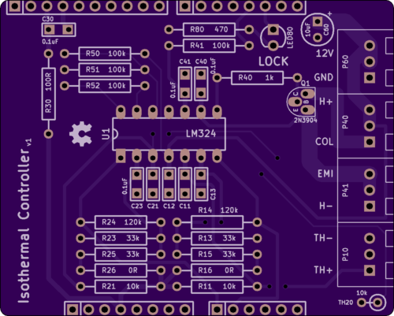
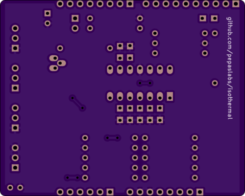

# isothermal

An Arduino shield which maintains a Hammond 1590BB at 25C +/-0.01C.

- [gerber files](kicad/releases/v1)
- [OSHPark link](https://oshpark.com/shared_projects/cw8b4XGm)
- [EEVBlog discussion](http://www.eevblog.com/forum/metrology/temperature-stabilised-enclosures-heating-and-or-cooling/msg1407134/#msg1407134)

See also  for PID tuning and measurements of a similar design (based on MCP9701 rather than thermistors).
